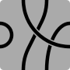

# How many Tsuro tiles are there?

This project started off as an investigation into [Burnside's Lemma](https://mathworld.wolfram.com/Cauchy-FrobeniusLemma.html). After I had learnt the lemma I took all the loose bits of investigative code and combined them into a playable game.

## The Naive Approach

A Tsuro tile (in it's simplest form) looks like this:

 

 It is a square tile with 2 nodes equally spaced on each of its four sides. Every node needs to be one and only one other node, so there will only ever be four "paths" on a simple Tsuro tile. WLOG you start with $8$ free points, and you can choose any out of the $7$ available to form your first path. Out of the $6$ remaining, you can again choose one arbitrarily and you have $5$ path options. Thus, the total number of tiles you can create is $ 7 \times 5 \times 3 = 105$. However, this calculation overlooks a critical complication- in Tsuro, players can rotate tiles at will (but not reflect them), thus making the following two tiles identical.

  &emsp; 

How do we distinguish between two tiles that are rotationally invariant? We could try dividing by 4, $105 / 4 = 26$, and this is neither a whole number nor correct, since not all the rotations are unique - consider the tile in which each point is connected to the one directly opposite it on the other side- this tile is rotationally symmetric. Dealing with the cases of symmetry is a nightmare, and not a scalable solution, so how do we progress?

To start, let's introduce some foundational algebraic concepts.

## What is a Group?

A group is a structure in abstract algebra, representing a collection of objects that are in one sense all similar. Commonly groups are used to refer to a symmetry as an entity, in that a single group signifies the ways in which a collection of objects are invariant, but their uses are numerous. The notion of symmetry can be formalized by the group axioms.

A group $G$ is a set $S$ and a binary operation &nbsp; $\cdot : S \times S \rightarrow S$ &nbsp; such that

- **Closure**: $\quad \forall a, b \in G, \quad ab \in G$

- **Associativity**: $\quad \forall a, b, c \in G, \quad a(bc) = (ab)c$

- **Identity**: $\quad \exists e \in G \quad \text{s.t.} \quad \forall a \in G, \quad ae = ea = a$

- **Inverse**: $\quad \forall a \in G \quad \exists b \in G \quad \text{s.t.} \quad ab = ba = e$

These laws and the nature of groups being used to model anything that can be conceptualized as certain symmetry will help us explore the properties of the rotational invariance of our $105$ Tsuro tiles analytically.

One last important thing to note before we conclude with our definition of groups is the idea of an "orbit". An orbit refers to the set of elements in a given set $X$ that can be reached from a particular element by the action of the elements of a group $G$. Or formally, $Orb(x) = \{g \cdot x \ | \ g \in G\}$.

Consider the $8$ possible bit strings of length 3. If we "tie the ends" or in other words allow rotational invariance, we reduce the number of "necklaces" to 4: $000$, $001$, $011$ and $111$. The bit strings $010$ and $100$ are equivalent to $001$ and the bit strings $110$, $101$ are equivalent to $011$. This equivalence splits the bit strings into $4$ orbits $X = \{000\} \cup \{001, 010, 100\} \cup \{011, 101, 110\} \cup \{111\}$. We'll come back to what we can do with this shortly.

## Burnside's Lemma
Burnside's Lemma is a tool that helps count the number of distinct objects under group actions, particularly in combinatorial contexts. It states that the number of distinct orbits of a set $X$ acted upon by a finite group $G$ can be calculated using the following formula. The number of distinct configurations of $X$ under $G$ is given by:

$|X/G| = \frac{1}{G} \sum_{g \in G} |X ^ g|$

where $|X ^ g|$ is the number of elements in $X$ that are fixed by $g$ (elements that remain unchanged when g is applied). We'll now apply the lemma to our bit necklace example. In this case, our set $X$ is the set of all 3 bit strings, and our group is [the Cyclic group of order 3](https://mathworld.wolfram.com/CyclicGroupC3.html) which contains the three rotations you can perform on a set of $3$ ordered objects, where the group operator is composition of rotations. Let the elements of $G$ be $r_0$ (the identity rotation), $r_1$ (a single element shift to the right) and $r_2$ (a two element shift to the right). You can verify the group axioms hold for $C_3$ on your own :) 

$|X / G| = \frac{1}{|G|}(|X^{r_0}| + |X^{r_1}| + |X^{r_2}|) = \frac{1}{3}(8 + 2 + 2) = 4$

The values for $|X^{r_n}|$ come from the number of elements unchanged by $r_n$ by our self imposed invariance laws. I encourage you to verify this by hand.

## A More Complex Example

So what does this have to do with Tsuro tiles? Well in our case our set is simply the $105$ distinct (for now) Tsuro tiles, and our set can be [presented](https://mathworld.wolfram.com/GroupPresentation.html) as $\langle r | r^4 = 1 \rangle$. This is the $C_4$ group! Think about it for a second- rotating a square is fundamentally the same action as cycling beads in a necklace one to the right. $C_4$ has four elements in it- so how many elements in $X$ are fixed by each $g \in C_4$?

- Case $1$: all $105$ elements are fixed
- Case $r$: the number of rotationally symmetric tiles- each path needs to be identical to the other $3$, so we need to be able to produce a single path we can replicate 3 more times (one for each rotation) to get a symmetric tile. WLOG select any node. Now there are 7 other nodes usable to form a path. Of these, exactly $2$ nodes (the nodes $2$ nodes in front and behind) are unusable to form a tile with quadruple symmetry. This is because if you were to create a path which would fully overlap another path on rotation, it's placement would require a single node to have $2$ connections. So there are $5$ remaining choices, each of which when replicated yields a symmetric tile.
- Case $r^2$: This is a little tricky. How many tiles have 2 degrees of rotational symmetry? WLOG fix a node, and connect it another forming a path- $r^2$ will fix a symmetric path $180^{\circ}$ degrees away. This leaves $4$ points which can be connected $3$ ways ($7 \times 3 = 21$). This accounts for almost all cases- recognizing that the path from node $1$ to $5$ is unique in that is it symmetrical in different ways when reflected vertically and diagonally, and additionally it can form a "swastika" shape. In the two cases not previously addressed we can yield $2$ tiles, one of which is a duplicate, giving us ($7 \times 3 + 2 + 2 = 25$) 
- Case $r^3$: the same as case $r$

By the lemma, $|X / G| = \frac{1}{4} (105 + 5 + 25 + 5) = 35$

## Final comments

The utility of orbits and Burnside's Lemma extend far beyond our fairly trivial case, but we'll end out foray into group theory here. Don't forget to check out [my implementation of Tsuro](https://mukundks2004.github.io/Tsuro/)!